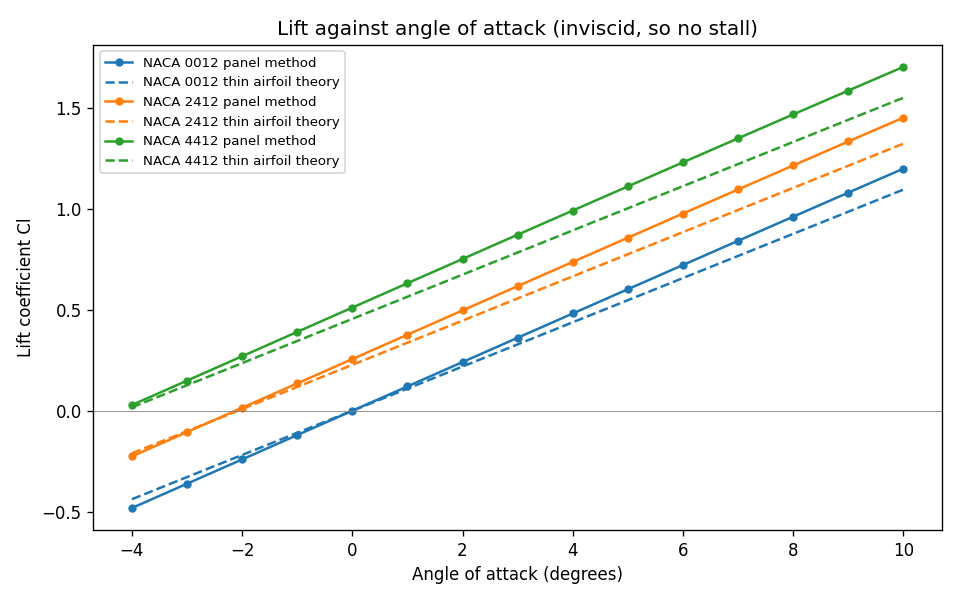
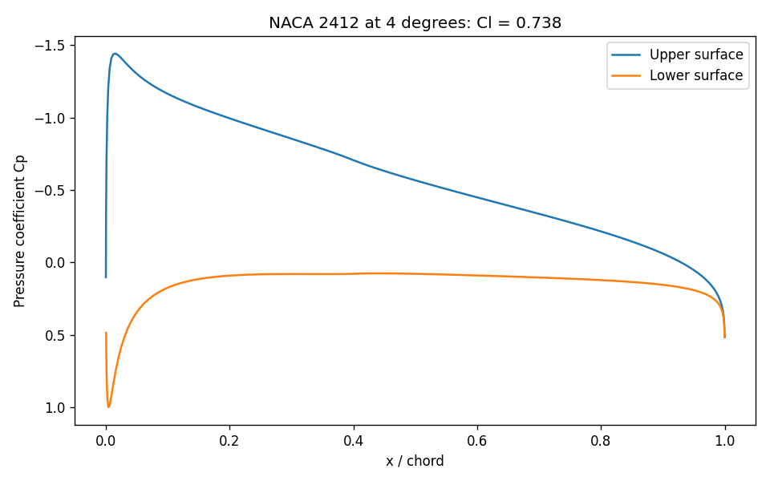

# Airfoil Panel Method

Predicts the lift, pressure and pitching moment of NACA 4-digit airfoils with
a Hess-Smith panel method in Python, and checks the answers against thin
airfoil theory.

**How this was built:** I wrote this with Claude, Anthropic's AI assistant,
as a learning project. Claude wrote the first version of the code, tests and
this README. The numbers below come from running that code.

## Who it is for

Students learning aerodynamics or numerical methods who want a small,
readable panel method: about 130 lines of solver code, with tests that check
it against known theory.

## How to run it

```bash
pip install -r requirements.txt
python run_analysis.py
pytest
```

`run_analysis.py` prints a results table and saves four charts and
`summary.csv` to `results/`. Pick your own airfoils and panel count with
`--airfoils 0012 4415 --panels 300`, and add `--show` to open the charts.

## How it works

1. `aero/naca.py` builds the airfoil shape from its four digits. For NACA
   2412: 2 percent camber, at 40 percent of the chord, 12 percent thick.
2. `aero/panel.py` cuts the surface into straight panels. Each panel gets a
   source, and all panels share one vortex. The code solves a linear system
   so that no flow passes through any panel and the flow leaves the trailing
   edge smoothly (the Kutta condition). Pressure then follows from the speed
   along the surface.
3. `aero/theory.py` gives the thin airfoil theory answer to compare against,
   plus a rough drag estimate.

The flow is inviscid: no viscosity, no boundary layer. So the method
predicts lift and pressure well at small angles, but it cannot predict drag
or stall. It will keep adding lift at 20 degrees, where a real wing has
stalled.

## Results

200 panels, from running `python run_analysis.py`:

| Airfoil | Lift slope per radian | Thin theory | Zero lift angle | Thin theory | Cm at 0 degrees | Thin theory |
|---|---|---|---|---|---|---|
| NACA 0012 | 6.893 | 6.283 | 0.00 | 0.00 | 0.0000 | 0.0000 |
| NACA 2412 | 6.881 | 6.283 | -2.13 | -2.08 | -0.0546 | -0.0531 |
| NACA 4412 | 6.868 | 6.283 | -4.26 | -4.15 | -0.1089 | -0.1062 |

- The zero lift angle and moment agree with thin airfoil theory within 0.11
  degrees and 0.003.
- The lift slope is about 10 percent above the thin theory value of 2 pi.
  Thin theory treats the airfoil as a line with no thickness. Thickness adds
  lift in inviscid flow, and the tests confirm that a 2 percent thick airfoil
  comes within 2 percent of 2 pi.
- Lift from the surface pressure matches lift from the circulation within 1
  percent, and pressure drag is close to zero, as inviscid theory says it
  must be.
- For NACA 2412 at 4 degrees, Cl goes from 0.701 with 20 panels to 0.741 with
  640, and changes by less than 0.5 percent between 160 and 320.





The table in `summary.csv` also has a zero lift drag estimate of 0.0095 for
all three airfoils at a Reynolds number of 3 million. That figure comes from
a flat plate friction formula, not the panel method. It assumes turbulent
flow over the whole surface, so it will read higher than wind tunnel data.

## What I learned

[FILL IN: two or three sentences in your own words, once you have worked
through the code. For example: why the Kutta condition is needed, why the
panel method gives more lift than thin airfoil theory, or why an inviscid
method cannot predict drag.]

## Next steps

- Compare against published wind tunnel data for these airfoils
- Add a boundary layer model to estimate drag and the start of stall

## Author

Rehumile Sechele, rehumiles@gmail.com
